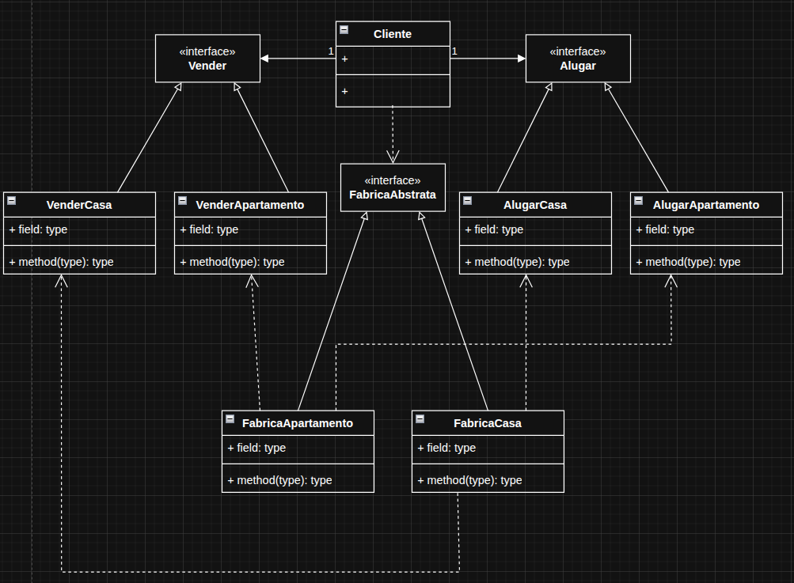

# Abstract Factory

O Abstract Factory é um padrão de projeto que serve para criar famílias de objetos relacionados sem precisar especificar suas classes concretas.

Em outras palavras: ele fornece uma “fábrica de fábricas” — ou seja, um conjunto de métodos para criar vários objetos que devem funcionar juntos, mantendo o código flexível e independente de implementações específicas.

O exemplo usado, foi o de uma imobiliária onde o cliente pode vender ou alugar uma casa ou apartamento, foi usado uma interface de fábrica abstrata, onde era usada pelas fábricas de apartamento e de casa.

